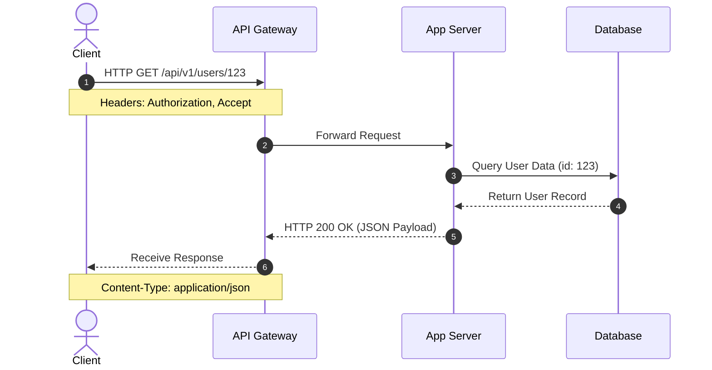
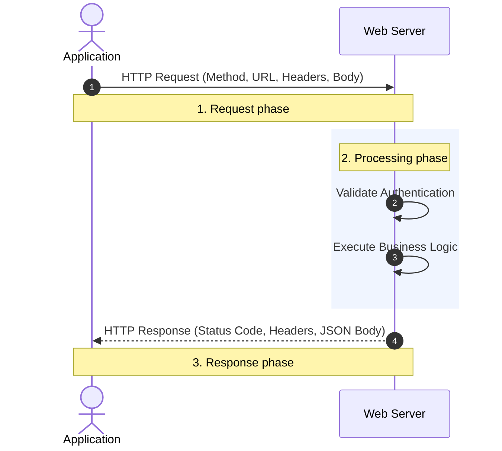

# **Consuming APIs: A Developer's Guide**

Consuming an API means writing code that sends a request to a server and handles the response.

## **1\. The Request-Response Cycle**

Every API interaction follows a simple loop. Understanding this loop is essential for debugging when things don't go to plan.  




* **The Request:** Your application sends an HTTP message containing a Method, URL, Headers, and sometimes a Body.  
* **The Processing:** The server receives the request, validates the authentication, and performs the logic.  
* **The Response:** The server sends back a Status Code, Headers, and a Body (usually JSON).

## **2\. The "Big Four" HTTP Methods**

When consuming an API, the method tells the server what action you want to perform on a resource.

| Method | Action | Example Path | Has Request Body?   |
| :---- | :---- | :---- | :---- |
| **GET** | Read / Retrieve | /books | No |
| **POST** | Create / Send | /books | Yes |
| **PUT** | Update / Replace | /books/101 | Yes |
| **DELETE** | Remove | /books/101 | No |

## **3\. Tools for Testing (Before you Code)**

Never start by writing code. Use a **Client Tool** to verify the API works as expected. This separates "API issues" from "code issues."

* **Postman / Insomnia:** Desktop apps for building and saving complex requests.  
* **cURL:** A command-line tool for quick tests.  
  `curl -X GET https://api.coop-library.co.nz/v1/books`  
* **Browser DevTools:** Use the 'Network' tab to inspect requests made by websites you visit.

## **4\. Consuming APIs in Python (The requests Library)**

The requests library is the standard for NZ developers due to its "human-friendly" syntax.

### **Installing the Library**

`python -m pip install requests`

### **The Basic GET Pattern**
```python
import requests

response = requests.get("https://api.coop-library.co.nz/v1/books")

if response.status_code == 200:  
    data = response.json()  # Convert JSON response to a Python Dictionary  
    print(data)  
else:  
    print(f"Error: {response.status_code}")
```
## **5\. Authentication: Getting Past the Gatekeeper**

Most professional APIs require an **API Key** or a **Bearer Token**. This is usually passed in the **Headers**.  
```json
headers = {  
    "Authorization": "Bearer YOUR_SECRET_TOKEN",  
    "Content-Type": "application/json"  
}

response = requests.get(url, headers=headers)
```

**⚠️ Security Warning:** Never hard-code your API keys directly in your scripts. Use environment variables (.env files) to keep them out of GitHub.

## **6\. Common Challenges**

* **Rate Limiting:** APIs often restrict how many requests you can make per minute. If you go over, you will receive a 429 Too Many Requests error.  
* **JSON Parsing:** Ensure the response is actually JSON before calling .json(), otherwise your script will crash.  
* **Timeouts:** Always set a timeout in your code so your application doesn't hang forever if the server is down.  
  `requests.get(url, timeout=5)`

## **7\. Learner Exercises**

1. **The Public Fetch:** Use the requests library to fetch a random image from the [DOG CEO API](https://dog.ceo/).  
2. **The Status Checker:** Write a script that takes a URL as input and prints whether the site is "Healthy" (200) or "Broken" (anything else).  
3. **The Header Hunt:** Use a tool like Postman to inspect the headers of a request to google.com. How many headers does the server send back?


https://www.alphavantage.co/

https://massive.com/docs

https://finance.yahoo.com/   yfinance library https://pypi.org/project/yfinance/

https://api.developer.nyse.com/client/top/

https://developer.trademe.co.nz/

