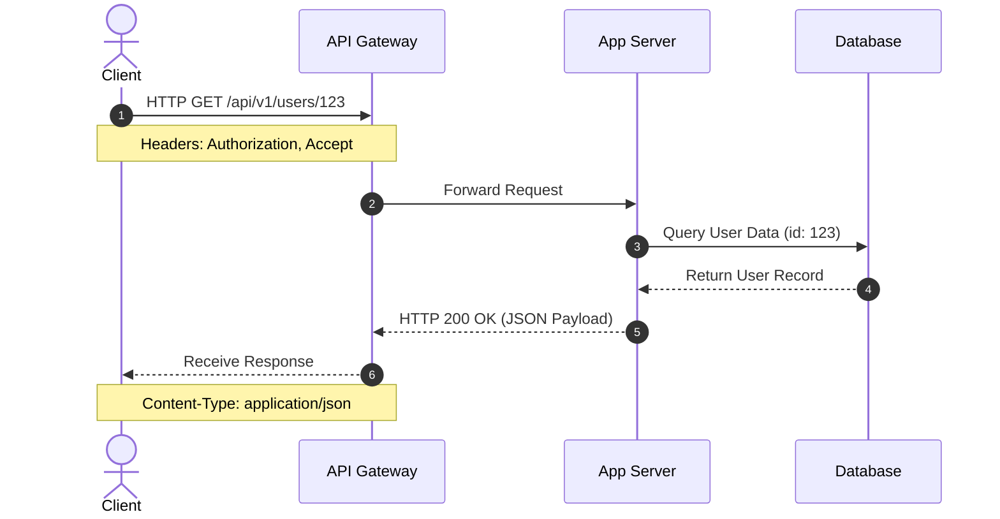
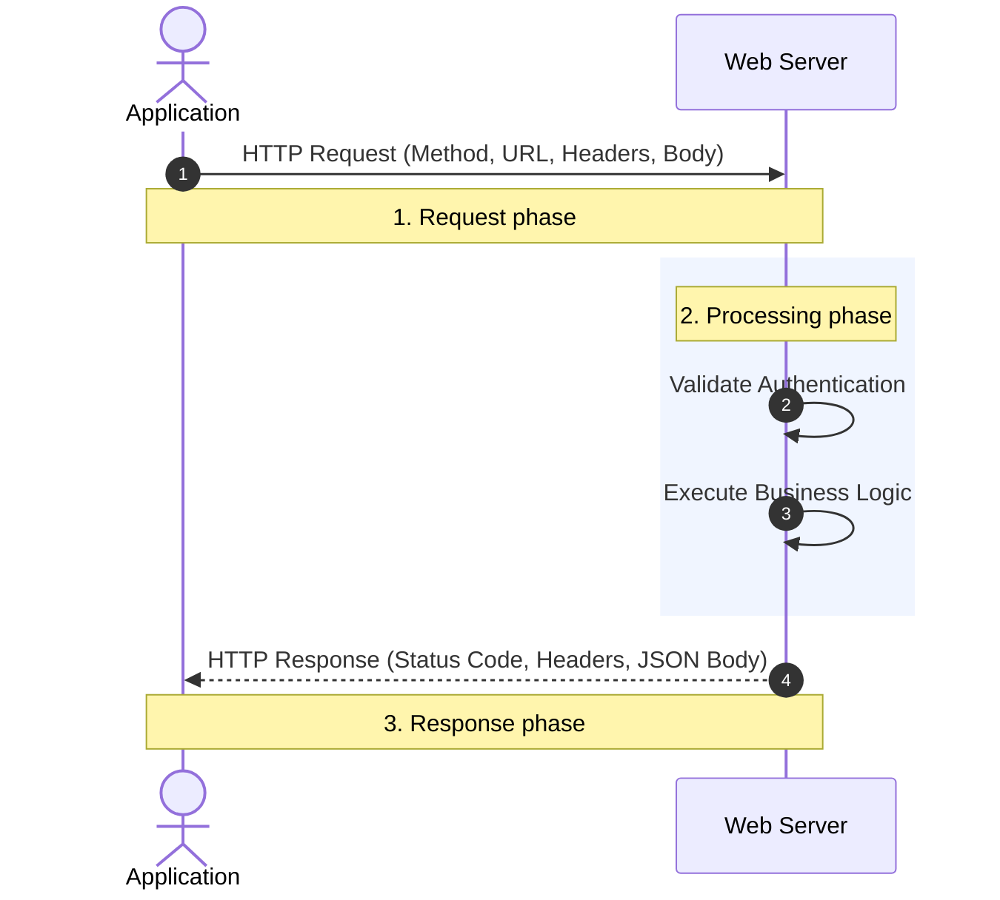

# Module 1: Consuming APIs (Web REST) with Python

This is the first lesson in the API course to assist in learning the practical skill of sending requests to an API and handling the response safely with Python.

The emphasis here is on the consumption side: making requests, understanding responses, and building a habit of checking what the server actually returned.

Before writing Python, it helps to test the API with `curl`. That gives you a quick way to check the endpoint, status code, headers, and response body.

By the end of this lesson, you can:
- explain the request/response cycle
- use the main HTTP methods
- make a basic API call with `requests`
- add headers and authentication tokens
- handle common failures without crashing their script

---

Consuming an API means writing code that sends a request to a server and handles the response.

## **1\. The Request-Response Cycle**

Every API interaction follows a simple loop. Understanding this loop is essential for debugging when things don't go to plan.

### Start with `curl`

```bash
curl -i https://api.coop-library.co.nz/v1/books
```

Useful `curl` variations:

```bash
curl -i "https://api.coop-library.co.nz/v1/books?page=1&limit=10"
curl -i -H "Accept: application/json" https://api.coop-library.co.nz/v1/books
curl -i -H "Authorization: Bearer YOUR_TOKEN" https://api.coop-library.co.nz/v1/books
```

Things to look for:

- the HTTP status code
- response headers
- whether the body is JSON
- whether the request needs authentication




***WHICH IMAGE IS BEST??***

* **The Request:** Your application sends an HTTP message containing a Method, URL, Headers, and sometimes a Body.
* **The Processing:** The server receives the request, validates the authentication, and performs the logic.
* **The Response:** The server sends back a Status Code, Headers, and a Body (usually JSON).

## **2\. The "Big Four" HTTP Methods**

When consuming an API, the method tells the server what action you want to perform on a resource.

| Method | Action | Example Path | Has Request Body?   |
| :---- | :---- | :---- | :---- |
| **GET** | Read / Retrieve | /books | No |
| **POST** | Create / Send | /books | Yes |
| **PUT** | Update / Replace | /books/101 | Yes |
| **DELETE** | Remove | /books/101 | No |

## 4. Tools for Testing Before You Code

Never start by writing code. Use a client tool to verify the API works as expected. This separates "API issues" from "code issues".

* **Postman / Insomnia:** Desktop apps for building and saving complex requests.
* **cURL:** A command-line tool for quick tests.

  `curl -i https://api.coop-library.co.nz/v1/books`

* **Browser DevTools:** Use the Network tab to inspect requests made by websites you visit.

---

## 5. Consuming APIs in Python (`requests`)

The `requests` library is a friendly way to make HTTP calls in Python.

### Installing the Library

`python -m pip install requests`

### Translating `curl` into Python

If you can read a `curl` command, you can usually turn it into Python:

```python
import requests

response = requests.get("https://api.coop-library.co.nz/v1/books", timeout=10)
print(response.status_code)
print(response.text[:200])
```

### The Basic GET Pattern

```python
import requests

url = "https://api.coop-library.co.nz/v1/books"

response = requests.get(url, timeout=10)
response.raise_for_status()

content_type = response.headers.get("Content-Type", "")
if "application/json" not in content_type:
    raise ValueError(f"Expected JSON, got {content_type}")

data = response.json()
print(data)
```

### Query parameters and response inspection

Most API work involves more than a plain GET. You should also know how to pass query parameters and inspect the response when something looks wrong.

```python
import requests

response = requests.get(
    "https://api.coop-library.co.nz/v1/books",
    params={"page": 1, "limit": 10, "genre": "fiction"},
    timeout=10,
)

print("URL:", response.url)
print("Status:", response.status_code)
print("Headers:", response.headers)
print("Text preview:", response.text[:200])
```

Useful things to inspect:

- `response.status_code` (see [Requests quickstart: response status codes](https://requests.readthedocs.io/en/latest/user/quickstart/#response-status-codes))
- `response.url` (see [Requests API reference: Response.url](https://requests.readthedocs.io/en/latest/api/#requests.Response.url))
- `response.headers` (see [Requests quickstart: response headers](https://requests.readthedocs.io/en/latest/user/quickstart/#response-headers))
- `response.text` (see [Requests quickstart: response content](https://requests.readthedocs.io/en/latest/user/quickstart/#response-content))
- `response.json()` (see [Requests quickstart: JSON response content](https://requests.readthedocs.io/en/latest/user/quickstart/#json-response-content))

### A safer pattern? 
The above examples are fine for quick tests, but in production code, it's good to add some safety checks:

- `timeout` stops a request from hanging forever
- `raise_for_status()` turns non-2xx responses into exceptions
- checking `Content-Type` helps prevent JSON parsing errors

### A simple POST example

Even in a consumption-focused lesson, it helps to show one write request so you can see how sending data works.

```python
import requests

payload = {
    "title": "The Bone People",
    "author": "Keri Hulme",
}

response = requests.post(
    "https://api.coop-library.co.nz/v1/books",
    json=payload,
    timeout=10,
)

response.raise_for_status()
print(response.status_code)
```

### A reusable session pattern

If you need to make several requests to the same API, a `Session` keeps the code tidier.

```python
import os
import requests

session = requests.Session()
session.headers.update({"Accept": "application/json"})

token = os.getenv("API_TOKEN")
if token:
    session.headers.update({"Authorization": f"Bearer {token}"})

response = session.get("https://api.coop-library.co.nz/v1/books", timeout=10)
```

---

## 6. Authentication: Getting Past the Gatekeeper

Most professional APIs require an **API key** or a **bearer token**. This is usually passed in the headers.

```python
import os
import requests

token = os.getenv("API_TOKEN")
if not token:
    raise RuntimeError("API_TOKEN is not set")

headers = {
    "Authorization": f"Bearer {token}",
    "Accept": "application/json",
}

response = requests.get("https://api.coop-library.co.nz/v1/books", headers=headers, timeout=10)
```

**⚠️ Security Warning:** Never hard-code your API keys directly in your scripts. Use environment variables or a `.env` file so tokens stay out of GitHub.

---

## 7. Common Challenges

* **Rate limiting:** APIs often restrict how many requests you can make per minute. If you go over, you will receive a `429 Too Many Requests` error.
* **JSON parsing:** Ensure the response is actually JSON before calling `.json()`, otherwise your script can crash.
* **Timeouts:** Always set a timeout in your code so your application doesn't hang forever if the server is down.
* **Wrong URL or method:** A `404` or `405` often means the path or HTTP method is wrong.
* **Missing auth:** A `401` or `403` often means the token is missing, expired, or not allowed.

### If you want one extra step

Once you are comfortable with the basic request, use this short error-handling pattern:

```python
import requests

try:
    response = requests.get("https://api.coop-library.co.nz/v1/books", timeout=10)
    response.raise_for_status()
    print(response.json())
except requests.exceptions.Timeout:
    print("Request timed out")
except requests.exceptions.HTTPError as exc:
    print(f"HTTP error: {exc}")
except requests.exceptions.RequestException as exc:
    print(f"Network/request error: {exc}")
```

---

## 8. Exercises

1. **The Public Fetch:** Use the requests library to fetch a random image from the [DOG CEO API](https://dog.ceo/).
2. **The Status Checker:** Write a script that takes a URL as input and prints whether the site is "Healthy" (200) or "Broken" (anything else).
3. **The Header Hunt:** Use a tool like Postman to inspect the headers of a request to google.com. How many headers does the server send back?
4. **Query Parameters:** Add `params` to a request and print `response.url` to confirm the query string was built correctly.
5. **Inspect and explain:** Print `status_code`, `headers`, and a short text preview for one API response.
6. **Write a book:** Send a sample `POST` request with a small JSON payload and confirm the status code.

---

### Further resources

- DOG CEO API: https://dog.ceo/
- Alpha Vantage: https://www.alphavantage.co/
- Yahoo Finance / `yfinance`: https://finance.yahoo.com/ and https://pypi.org/project/yfinance/
- NYSE API: https://api.developer.nyse.com/client/top/
- Trade Me Developer Portal: https://developer.trademe.co.nz/
- Example docs site: https://massive.com/docs
- https://pypi.org/project/datamodel-code-generator/0.33.0/
