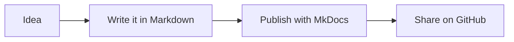
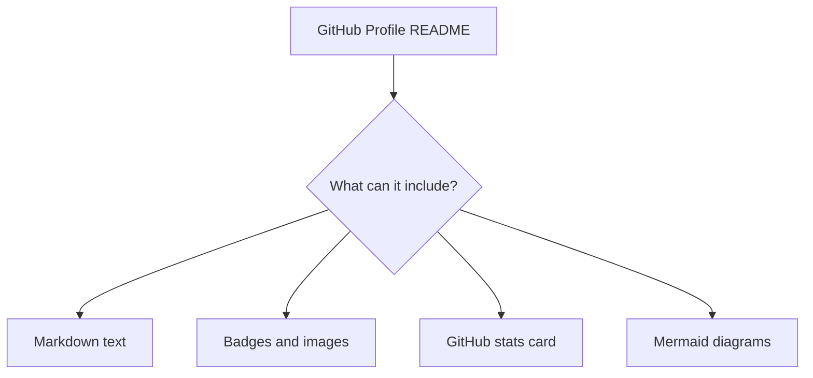

# Creating a GitHub Profile Page with Markdown

Your GitHub profile page is a living document — a public landing page that introduces you to potential employers, collaborators, and the wider open-source community. The best part: it is built entirely with the Markdown you already know.

---

## 1. How it works

GitHub has a special trick: if you create a **public repository whose name exactly matches your GitHub username**, the `README.md` inside it automatically becomes your profile page.

For example, if your username is `whanau-dev`, you create a repo called `whanau-dev` and add a `README.md`. That file is what visitors see when they go to `github.com/whanau-dev`.

### Steps to set it up

1. Log in to GitHub.
2. Click **New repository**.
3. Set the **repository name** to your exact GitHub username.
4. Tick **"Add a README file"**.
5. Set it to **Public**.
6. Click **Create repository**.

GitHub will show you a hint: *"✨ You found a secret! `username/username` is a special repository..."*

---

## 2. What renders on GitHub

Everything from your Markdown primer works here. A quick recap of what is particularly useful for a profile:

| Feature | Syntax | Notes |
| :--- | :--- | :--- |
| Headings | `# H1`, `## H2` | Use one `#` for your name |
| Bold / italic | `**bold**`, `*italic*` | Works everywhere |
| Lists | `- item` or `1. item` | Good for skills lists |
| Links | `[Text](URL)` | Social links, portfolio |
| Images | `` | Avatar, banners, badges |
| Tables | `\| col \| col \|` | Comparing skills, tools |
| Task lists | `- [x] Done` | "Currently learning" tracker |
| Blockquotes | `> quote` | Personal motto or bio |
| Mermaid diagrams | ` ```mermaid ` | ✅ Supported natively on GitHub |
| Callouts | `> [!NOTE]` | ✅ GitHub-specific feature |

---

## 3. A starter template

Copy and adapt this in your `README.md`:

```markdown
# Kia ora, I'm [Your Name] 👋

> Python enthusiast, lifelong learner, based in Aotearoa New Zealand.

## About me
- 🔭 Currently working on: [your project]
- 🌱 Learning: Python, MkDocs, and Markdown
- 💬 Ask me about: automation, data, and open source
- 📫 Contact: [your email or LinkedIn URL]

## Skills and tools
- **Languages:** Python, SQL
- **Docs:** Markdown, MkDocs, Mermaid diagrams
- **Tools:** Git, GitHub, VS Code

## What I'm learning right now
- [x] Markdown and Mermaid diagrams
- [x] MkDocs documentation sites
- [ ] GitHub Actions
- [ ] FastAPI

## A sample diagram from my recent work


---
*Updated May 2026*
```

---

## 4. Adding badges

Badges are small image links that show stats or skill icons. They are just standard Markdown image links pointing to a service that generates SVG images on the fly.

### A static skill badge (Shields.io)

```markdown

```

Some popular badge sources:
- [shields.io](https://shields.io) — custom static and dynamic badges
- [skillicons.dev](https://skillicons.dev) — clean tech skill logos

### GitHub stats card

```markdown

```

Replace `YOUR_USERNAME` with your actual GitHub username.

> [!NOTE]
> Stats cards are hosted by community projects, not GitHub itself. They may occasionally be slow or unavailable.

---

## 5. GitHub-specific callouts

GitHub has its own callout syntax that renders as styled coloured boxes. Use these in your profile README:

```markdown
> [!NOTE]
> Useful information that readers should know.

> [!TIP]
> Helpful advice for doing things better.

> [!WARNING]
> Urgent info that needs immediate attention.
```

> [!IMPORTANT]
> These do **not** render in MkDocs. Use `!!! note` admonitions there instead. This is the key difference from last week's session.

---

## 6. Mermaid diagrams on GitHub

GitHub renders Mermaid natively in all Markdown files, including your profile README. No extra configuration needed — just use a fenced code block with the `mermaid` language tag.



---

## 7. Tips for a strong profile

- **Keep it current.** An outdated profile is worse than a minimal one.
- **Lead with your name and a one-liner.** Recruiters skim fast.
- **Link to your best work.** Pin repositories on your profile page too.
- **Show what you're learning.** A `- [ ]` task list signals a growth mindset.
- **Avoid a wall of badges.** A handful of relevant ones is more readable than fifty.

---

## 8. Learner exercises

1. **Set up your repo:** Create the special `username/username` repository on GitHub and confirm your README appears on your profile page.
2. **Adapt the template:** Personalise the starter template with your own info and at least one task list.
3. **Add a badge:** Use [shields.io](https://shields.io) to create a Python badge and add it to your README.
4. **Add a diagram:** Include a simple Mermaid flowchart showing one of your learning journeys or workflows.
5. **Rendering comparison:** Copy a `!!! tip` admonition from your MkDocs docs and paste it into GitHub — observe that it does not render as a styled box.

---

*This guide is part of the Learners Co-op series. See also: `markdown_primer.md`, `mkdocs-primer.md`, `mermaid_examples.md`.*

