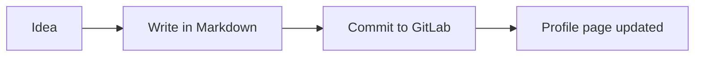
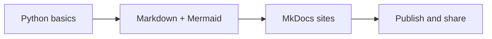

# Creating a GitLab Profile Page with Markdown

GitLab, like GitHub, lets you build a public profile page using Markdown. The mechanism is slightly different, but the Markdown skills you already have apply directly. This guide covers what is the same, what is different, and what to watch out for.

---

## 1. How it works

GitLab uses a similar "special project" trick to GitHub:

- Create a **public project** (repository) whose name **exactly matches your GitLab username**.
- Add a `README.md` to the root of that project.
- GitLab automatically displays it on your profile page at `gitlab.com/your-username`.

### Steps to set it up

1. Log in to GitLab.
2. Click **New project** → **Create blank project**.
3. Set the **Project name** to your exact GitLab username.
4. Set visibility to **Public**.
5. Tick **"Initialise repository with a README"**.
6. Click **Create project**.

GitLab will show a notice: *"🎉 This is your personal project. Your profile README will be displayed here."*

---

## 2. What renders on GitLab

GitLab uses its own Markdown renderer (GitLab Flavored Markdown, or GFM), which is similar to GitHub's but has some differences. Most of your Markdown skills carry over directly:

| Feature | Renders on GitLab? | Notes |
| :--- | :---: | :--- |
| Headings (`#`, `##`) | ✅ | Same as everywhere |
| Bold / italic | ✅ | Same syntax |
| Lists (ordered + unordered) | ✅ | Same syntax |
| Links | ✅ | Same syntax |
| Images | ✅ | Same syntax |
| Tables | ✅ | Same as GFM |
| Task lists (`- [x]`) | ✅ | Same syntax |
| Blockquotes (`>`) | ✅ | Same syntax |
| Fenced code blocks | ✅ | Same syntax + syntax highlighting |
| Footnotes | ✅ | Same syntax |
| Mermaid diagrams | ✅ | Supported, but requires `graph` or `flowchart` keyword |
| Math (`$...$`) | ✅ | Supported via KaTeX |
| GitHub-style callouts (`> [!TIP]`) | ❌ | These do **not** work on GitLab |
| Admonitions (`!!! note`) | ❌ | These are MkDocs-specific, not plain Markdown |

---

## 3. Mermaid on GitLab

GitLab renders Mermaid diagrams natively — no configuration needed. The syntax is the same as what you used last week. Simply use a fenced block with the `mermaid` language tag:

````markdown

````

> **Note:** GitLab uses its own Mermaid version. Very new diagram types may not yet be supported. If a diagram does not render, simplify the syntax and check the [GitLab Mermaid docs](https://docs.gitlab.com/ee/user/markdown.html#mermaid).

---

## 4. A starter template

Copy and adapt this in your project's `README.md`:

```markdown
# Kia ora, I'm [Your Name]

> Python learner, based in Aotearoa New Zealand.

## About me

- 🔭 Currently working on: [your project or study]
- 🌱 Learning: Python, Markdown, and documentation tooling
- 📫 How to reach me: [your email or LinkedIn]

## Skills

- **Languages:** Python, SQL
- **Documentation:** Markdown, Mermaid diagrams
- **Tools:** Git, GitLab, VS Code

## Currently learning

- [x] Git basics
- [x] Markdown and Mermaid diagrams
- [ ] Python packaging
- [ ] CI/CD pipelines

## My learning journey



---
*Last updated: May 2026*
```

---

## 5. Key differences from GitHub

This table summarises the rendering differences that matter most for your profile:

| Feature | GitHub | GitLab |
| :--- | :--- | :--- |
| Profile trigger | `username/username` repo | `username/username` project |
| Callout syntax | `> [!TIP]` ✅ | `> [!TIP]` ❌ (not supported) |
| Admonitions | ❌ (MkDocs only) | ❌ (MkDocs only) |
| Mermaid support | ✅ Native | ✅ Native |
| Math support | ✅ MathJax | ✅ KaTeX |
| Badges (Shields.io) | ✅ | ✅ |
| Stats cards | Community widgets available | Fewer community widgets |
| Emoji (`:smile:`) | ✅ | ✅ |

### Callouts: the main gotcha

GitHub's `> [!NOTE]` callout syntax does **not** work on GitLab. To highlight something on GitLab, use a plain blockquote or bold text:

```markdown
> **Note:** This is an important point.
```

Or use a simple bold heading approach:

```markdown
**📌 Note:** This is an important point.
```

---

## 6. Adding badges

Badges work exactly the same way on GitLab — they are just Markdown image links.

```markdown


```

You can generate your own at [shields.io](https://shields.io) or browse ready-made ones at [skillicons.dev](https://skillicons.dev).

---

## 7. Images and assets

Unlike GitHub, GitLab makes it easy to upload images directly through the web UI and copy a Markdown link to paste into your README.

To upload an image on GitLab:
1. Edit your `README.md` in the web editor.
2. Drag and drop an image into the editor.
3. GitLab generates the Markdown snippet automatically.

For images hosted elsewhere, the standard syntax applies:

```markdown

```

---

## 8. Tips for a strong GitLab profile

- **Use the web editor first.** It shows a live preview as you type.
- **Keep the README focused.** Visitors want to know who you are, what you do, and how to reach you — in that order.
- **Commit a small change regularly.** Activity on GitLab is visible on your profile and shows you are actively learning.
- **Link your best project.** GitLab lets you pin projects on your profile — use it.
- **Use Mermaid to stand out.** Most profiles are plain text. A clean diagram shows technical confidence.

---

## 9. Learner exercises

1. **Create the project:** Set up your `username/username` project on GitLab and confirm the README appears on your profile.
2. **Adapt the template:** Personalise the starter template above with your real details and current learning goals.
3. **Add a Mermaid diagram:** Include a flowchart or sequence diagram from last week's Mermaid session.
4. **Badge row:** Create at least two badges using [shields.io](https://shields.io) and add them near the top of your README.
5. **Cross-platform comparison:** Look at your GitHub profile and your GitLab profile side by side. Note any differences in how the same Markdown renders on each platform.

---

## 10. Quick syntax reference for both platforms

```markdown
# Name heading
**Bold**, *italic*, ~~strikethrough~~

- Unordered list item
1. Ordered list item
- [x] Completed task
- [ ] Incomplete task

[Link text](https://example.com)


| Column A | Column B |
| :--- | :--- |
| Value | Value |

> Blockquote or note (works on both platforms)


```

---

*This guide is part of the Learners Co-op series. See also: `markdown_primer.md`, `mkdocs-primer.md`, `github_profile.md`.*

