### Introduction to Mermaid for Markdown Diagrams

---

### **What is Mermaid?**

#### **Overview of Mermaid**
Mermaid is a JavaScript-based diagramming tool that allows users to create diagrams directly within Markdown. It supports several diagram types, such as flowcharts, sequence diagrams, Gantt charts, and more.

#### **Benefits of Using Mermaid**
- **Integrates seamlessly with Markdown**: Ideal for documentation and README files.
- **Easy to learn**: Uses simple text-based syntax.
- **Dynamic and customisable**: Supports various styles and themes.

#### **Common Use Cases**
- Flowcharts for process visualisation.
- Sequence diagrams for depicting interactions in systems.
- Gantt charts for project timelines.

---

### **Setting Up Mermaid**

#### **Enabling Mermaid in Markdown**
- **GitHub**: Mermaid diagrams are automatically rendered in Markdown files.
- **VS Code**: Use extensions like "Markdown Preview Mermaid Support" to render Mermaid diagrams.

#### **Basic Mermaid Syntax**
```markdown
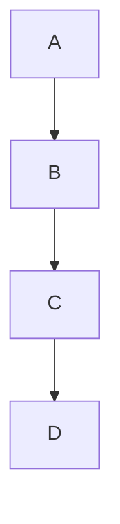
- **Backticks** (` ``` `) denote code blocks.
- **`mermaid`** specifies the Mermaid block.
- **Flowchart TD**: Defines a top-down flowchart.


---

### **Creating Basic Diagrams**

#### **Flowcharts**
- **Syntax**: 
  ```mermaid
  flowchart LR
      A[Start] --> B[Process]
      B --> C{Decision}
      C -->|Yes| D[End]
      C -->|No| E[Another Process]
  ```
  - **Nodes**: `A[Text]`, `C{Text}`.
  - **Links**: `-->`, `-->|Text|`.

#### **Sequence Diagrams**
- **Syntax**:
  ```mermaid
  sequenceDiagram
      participant A as Alice
      participant B as Bob
      A->>B: Hello Bob
      B-->>A: Hi Alice
  ```
  - **Participants**: `participant A as Alice`.
  - **Messages**: `A->>B: Hello Bob`.

#### **Exercise**
- Create a flowchart that depicts a decision-making process.
- Create a sequence diagram showing a simple interaction.

---

### **Customising Diagrams**

#### **Basic Customisation**
- Change **node shapes** using different brackets:
  - `[Text]` for rectangles.
  - `{Text}` for diamonds (decision points).
- **Colours and themes**: Use class definitions or themes for styling.

#### **Example**:
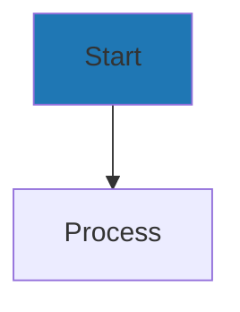
Using with Themes and themeVariables

https://mermaid.js.org/config/theming.html
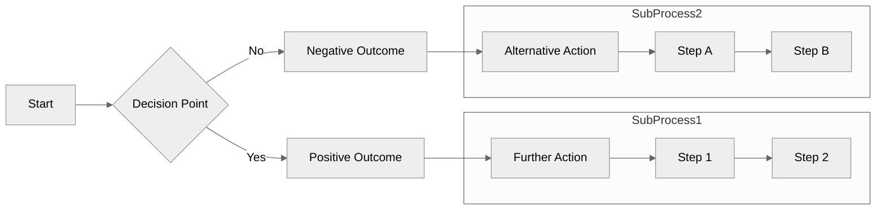

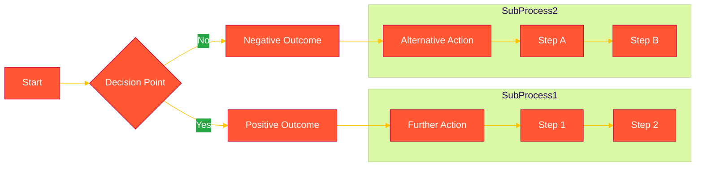

---

### **Quick Tips and Best Practices**

#### **Best Practices**
- Keep diagrams simple for readability.
- Use meaningful labels and consistent shapes.
- Use Mermaid's inline documentation for complex diagrams.

#### **Troubleshooting**
- **Syntax errors**: Ensure correct brackets and symbols.
- **Rendering issues**: Check if Mermaid is enabled in the Markdown viewer.

#### **Additional Resources**
- [Mermaid Official Documentation](https://mermaid-js.github.io/mermaid/#/)
- Markdown editor plugins with Mermaid support.

---


---

### A couple that I am using to confirm existing process for a client
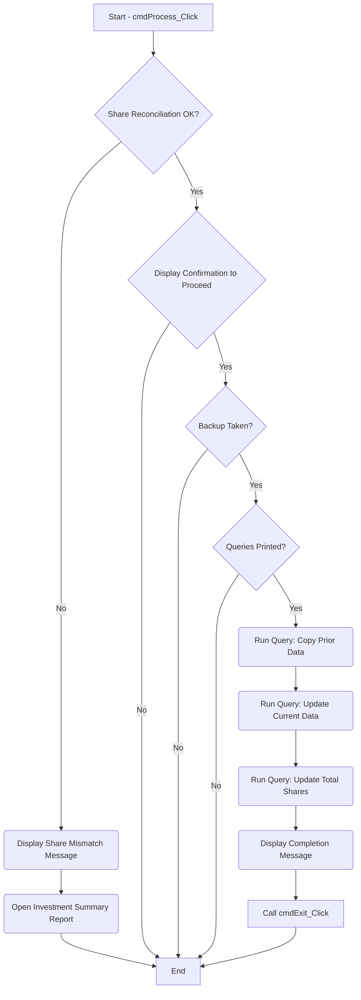
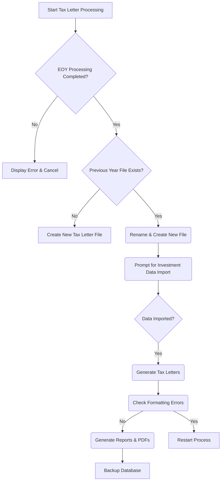
## Other examples
### Gantt Chart
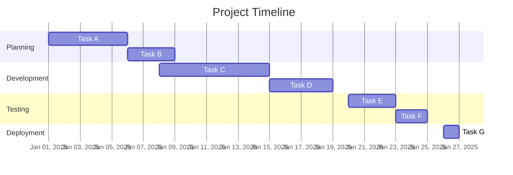

### Class Diagram
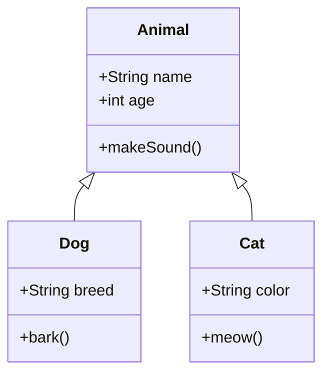

### Entity Relationship Diagram
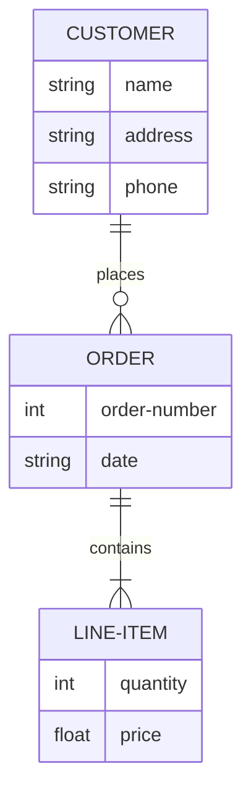

### Pie Chart
Try with pie showData or just pie

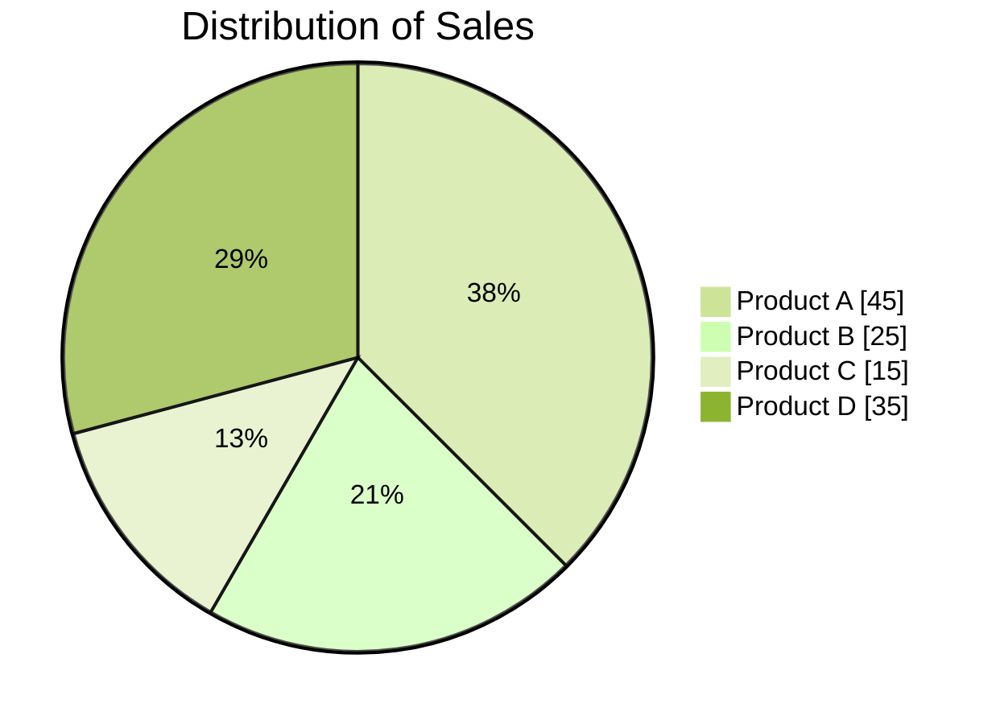

### State Diagram
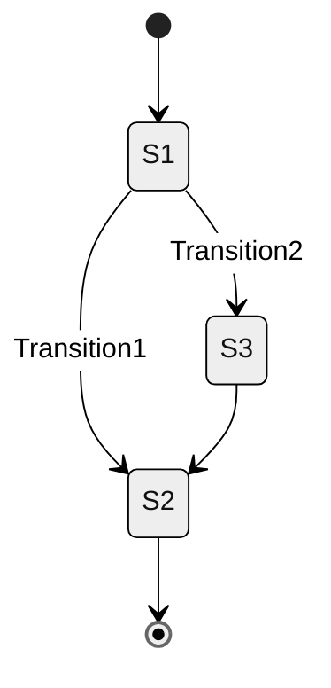

### Network Diagram
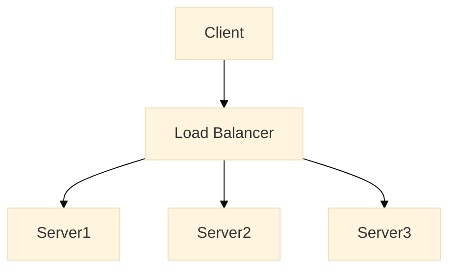

### Sequence Diagram
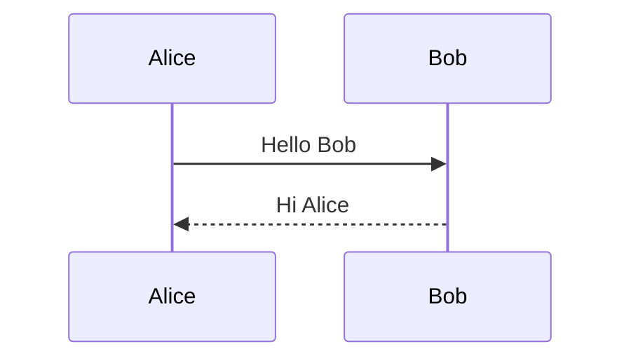

### Git Diagram
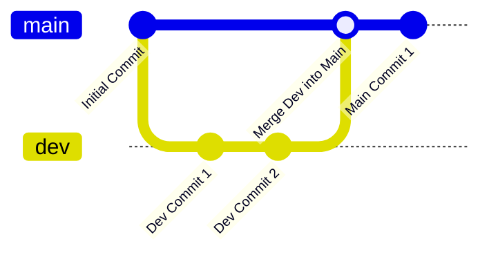

### Journey Diagram
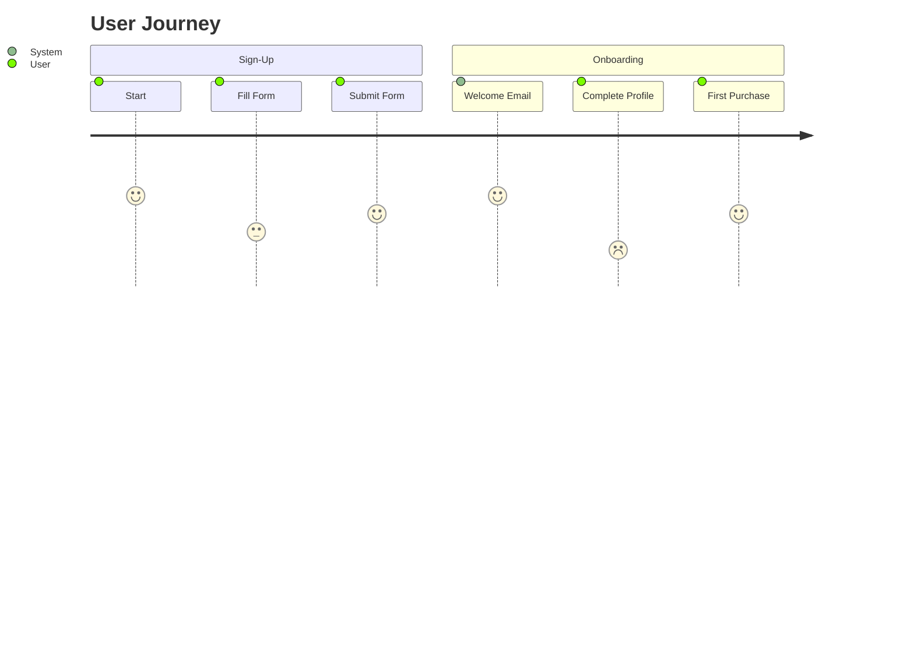

